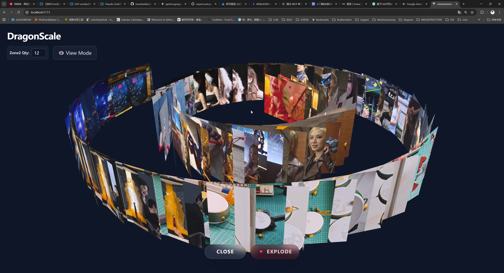
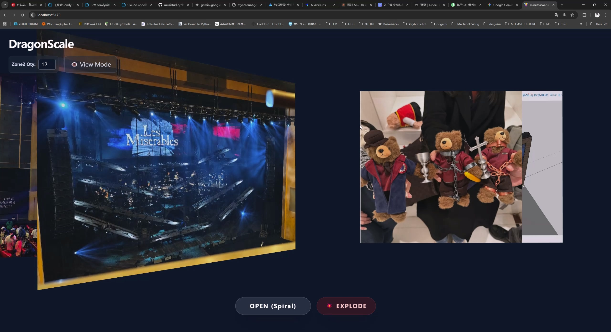
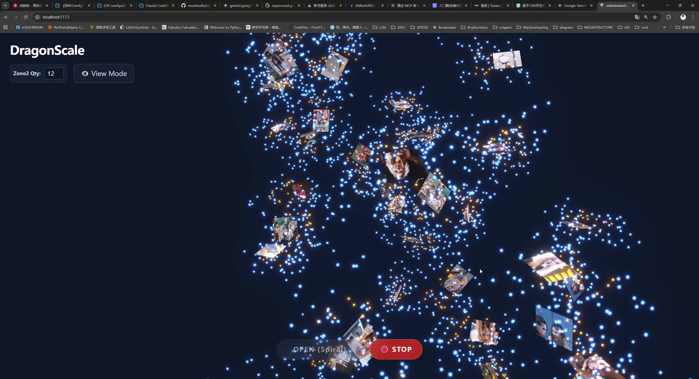

# 🐉 DragonScale 3D (龙鳞装可视化)

   

> A 3D interactive visualization of the traditional Chinese "Dragon Scale Binding" book format, featuring high-performance video rendering and local asset persistence.
>
> 一个基于 React Three Fiber 的传统“龙鳞装”书籍 3D 可视化 Demo，具备高性能视频流调度与本地数据持久化功能。

## 📸 Gallery (截图展示)

<table>
  <tr>
    <td align="center">
      
      <br />
      <strong>Spiral View (展开模式)</strong>
    </td>
    <td align="center">
      
      <br />
      <strong>Stack View (闭合模式)</strong>
    </td>
  </tr>
  <tr>
    <td align="center">
      
      <br />
      <strong>Explode Effect (爆炸视图)</strong>
    </td>
  </tr>
</table>

## ✨ Features (功能特性)

### 🎨 Visual & Interactive (视觉与交互)

* **3D Spiral Layout**: Mathematically generated spiral geometry simulating the ancient scroll binding technique.
* **Immersive Animation**: Smooth transitions between "Spiral Mode" (Open) and "Stack Mode" (Closed).
* **Explosion Effect**: A particle-based "Explode" mode for deconstructing the visual elements.
* **Interactive Editing**: Click to upload and replace images/videos on any page (Front, Spine, Back).

### ⚙️ Technical Highlights (技术亮点)

* **Smart Video Scheduling (智能视频调度)**:
  * Implemented a **"Watchdog" mechanism** and **Viewport Detection** to solve browser limits on concurrent video decoders (50+ videos).
  * Videos only play when the leaf is **in the center viewport** AND **facing the camera** (Dot Product calculation).
  * Automatic retry logic ensures playback reliability under high load.
* **Performance Optimization (性能优化)**:
  * **Backface Culling**: Logic-based culling prevents rendering/playing content on the back of leaves when hidden.
  * **Delayed Pause**: Implemented a grace period (buffer time) when leaves exit the view to prevent stuttering during fast scrolling.
* **Local Persistence (本地持久化)**:
  * Powered by **IndexedDB**.
  * Supports saving large user-uploaded video/image assets locally.
  * **Auto-Restore**: Automatically rebuilds the 3D book state upon page reload.

## 🛠 Tech Stack (技术栈)

* **Core**: React, TypeScript, Vite
* **3D Engine**: Three.js, @react-three/fiber, @react-three/drei
* **Animation**: Maath (for smooth dampening)
* **Post-Processing**: @react-three/postprocessing (Bloom effects)
* **Storage**: Native IndexedDB API
* **Styling**: Tailwind CSS

## 🚀 Getting Started (快速开始)

### Prerequisites (前置要求)

* Node.js (v16+)
* npm or yarn

### Installation (安装)

```bash
# Clone the repository
git clone [https://github.com/claudemit/dragon-scale-3d.git](https://github.com/claudemit/dragon-scale-3d.git)

# Enter the directory
cd dragon-scale-3d

# Install dependencies
npm install


Run Locally (本地运行)
Bash
  npm run dev
Open http://localhost:5173 in your browser.


🎮 Controls (操作说明)
Left Mouse: Rotate camera (旋转视角)

Right Mouse: Pan camera (平移视角)

Scroll: Zoom in/out (缩放)

UI Buttons:

OPEN (Spiral): Unfold the book into a dragon scale spiral.

EXPLODE: Break the book into particles.

Editing Mode: Toggle click-to-upload functionality.

Reset Data: Clear all locally saved assets (IndexedDB) and reset to default.

📂 Project Structure (项目结构)
src/
├── App.tsx             # Main logic (3D scene, State, IndexedDB logic)
├── components/         # (If you refactor later)
├── assets/             # Static assets
└── index.css           # Tailwind imports
